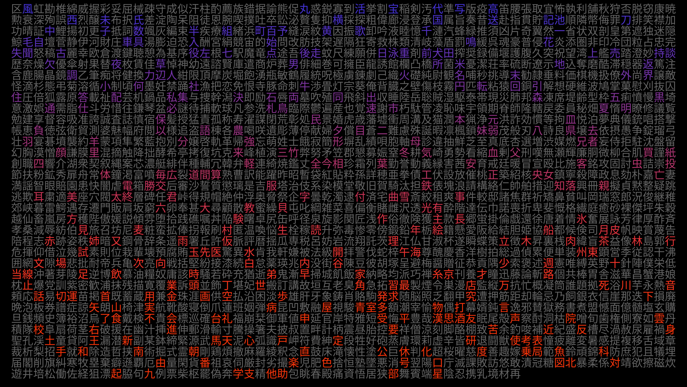

# kanjis
A simple and easily customizable python script that creates an image with known kanjis according to Wanikani level

It asks for the wanikani level, and then returns an image like that one:

The kanji data json file comes from this github repository:
[davidluzgouveia/kanji-data](https://github.com/davidluzgouveia/kanji-data/).